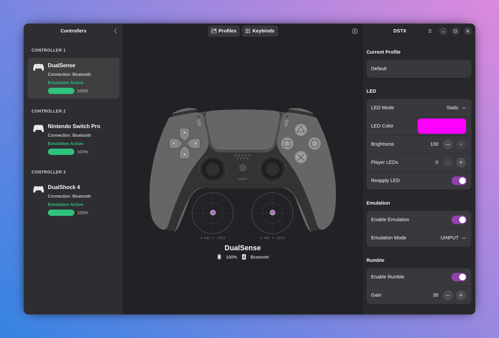

# DSTX

Xbox 360 Controller Emulator for Linux. Supports Dualshock4, DualSense and Nintendo Switch Pro Controllers

**Official Website:** [dstxapp.org](https://dstxapp.org)

## Table of Contents

- [Description](#description)
- [Features](#features)
- [Architecture Overview](#architecture-overview)
- [System Requirements](#system-requirements)
- [Building C core from source](#building-c-core-from-source)
- [Building GUI (Vala/GTK4) from source](#building-gui-valagtk4-from-source)
- [Packaging formats](#packaging-formats)
- [Configuration (Profiles)](#configuration-profiles)
- [Commands Reference](#commands-reference)
- [Terminal User Interface (TUI) – core](#terminal-user-interface-tui--core)
- [D-Bus API](#d-bus-api)
- [Graphical Interface (GUI)](#graphical-interface-gui)
- [Security Architecture](#security-architecture)
- [License](#license)
- [Contributing](#contributing)
- [Appendix 1: LED Effects](#appendix-1-led-effects)
- [Appendix 2: Stick Sensitivity Presets](#appendix-2-stick-sensitivity-presets)
- [Appendix 3: Keybinds (Button Remapping)](#appendix-3-keybinds-button-remapping)

## Description

DSTX is a low-latency daemon that emulates an Xbox 360 controller using real Sony DualShock 4, DualSense or Nintendo Switch Pro controllers. It supports full button remapping, adjustable stick sensitivity, deadzone, configurable LED effects, rumble with gain, profile-based settings and more.

The project consists of two independent components:

- Core (C language) – a system service that handles hardware access, input translation, virtual device emulation, and provides CLI, TUI, and D-Bus interfaces.
- GUI (Vala / GTK4) – a graphical application that runs as a regular user and communicates exclusively over D-Bus. It does not require root privileges.

All source code is published under the GNU General Public License v3.0.

## Features

- Emulates Xbox 360 controller via uinput or UHID (experimental)
- Supports DualShock 4, DualSense and Nintendo Switch Pro Controller via USB and Bluetooth
- Full button remapping (any physical button can be mapped to any logical button)
- Adjustable stick deadzone (0-100%)
- Eight independent stick sensitivity presets per stick (left/right can differ)
- Y-axis inversion for each stick (up becomes down)
- Digital trigger mode (L2 and R2 act as buttons instead of analog axes)
- LED static color and eight dynamic effects
- Global LED brightness control (both static and dynamic LED modes)
- Player LED indicator for DualSense controllers
- Rumble on/off with gain (intensity) control
- Profile system with JSON storage and auto-save
- Inotify-based profile reloading on external changes
- D-Bus interface with full introspection (allows remote control)
- Command-line interface (CLI) for scripting and direct control
- Terminal user interface (TUI) for interactive control
- GTK4 graphical interface (runs as user, uses D-Bus backend)

## Architecture Overview

The core component (single binary "dstx") runs two processes:

1. Daemon mode (`dstx --daemon`) – runs as root, accesses `/dev/hidraw*`, `/dev/evdev`, `/dev/uinput` and `/dev/uhid`. It creates one worker thread per connected controller.
2. TUI mode (`dstx` without arguments) – user-space process that attaches to shared memory (/dev/shm/dstx_shared_mem) and provides the terminal graphical interface.

An optional D-Bus bridge (dstx-dbus) exposes the entire API via the system bus. Its XML introspection file is provided (org.dstx.Bridge.xml). The GUI uses this bridge exclusively and never touches shared memory or hardware directly.

All communication between the daemon and user processes (TUI, D-Bus bridge) is done through shared memory with atomic operations and mutex protection for consistency. The daemon runs with real-time scheduling for the worker threads to guarantee low
latency.

## System Requirements

- x86_64 processor (packages). Not tested on ARM.

- Linux kernel >= 6.0 (older may work but hid-nintendo, DualSense and UHID features need recent support).

- Systemd – not strictly required (the daemon can be run manually), but used by the install script for service management, and by the d-bus bridge to control the service.

### Dependencies for building the C core:
- gcc, make, pkg-config
- libcjson (for JSON profile handling)
- libdbus-1 (only for the D-Bus bridge)
- zlib, pthread, rt, math library

### Dependencies for building the GUI (Vala/GTK4):
- meson, ninja, valac (Vala compiler)
- glib-2.0 >= 2.58, gobject-2.0, gio-2.0, gio-unix-2.0
- gtk4 >= 4.20.0
- libadwaita-1 >= 1.8.0
- gee-0.8 >= 0.20.0
- json-glib-1.0 >= 1.6
- librsvg-2.0 >= 2.48
- libm (math library)

### Runtime dependencies (core):
- udev (for device permissions)
- dbus (optional, for the bridge)
- polkit and sudoers (optional, for service control from user sessions)

## Building C core from source

All core sources are located in the "dstx/" directory.

### 1. Install the dependencies

  Debian/Ubuntu
  
  	sudo apt update && sudo apt install build-essential pkg-config libcjson-dev libdbus-1-dev zlib1g-dev

  Fedora

  	sudo dnf install gcc make pkgconfig cjson-devel dbus-devel zlib-devel

  Arch

  	sudo pacman -Syu && sudo pacman -S gcc make pkg-config cjson dbus zlib

### 2. Clone the repo

  	git clone https://github.com/a-lameira/DSTX.git
  
### 3. Enter the build directory
  
  	cd DSTX/dstx

### 4. Choose the compilation target
  
  4.1. Only core (daemon+TUI) -- if you want a minimal installation
  
  	make dynamic-core
  
  4.2. Core + bridge -- if you want to use the GUI
  
  	make dynamic-all

### 5. Run the setup script and choose option 1 (requires root privileges)

	sudo ./setup-dstx.sh

The script will:

1. Copy dstx and dstx-dbus to /usr/local/bin/
2. Create the system group "dstx"
3. Install udev rules to /etc/udev/rules.d/99-dstx.rules
4. Install systemd services (dstx-daemon.service and dstx-dbus.service)
5. Add Polkit rules to /etc/polkit-1/rules.d/10-dstx.rules
6. Add sudoers rules to /etc/sudoers.d/dstx
7. Install D-Bus policy to /etc/dbus-1/system.d/org.dstx.Bridge.conf
8. Start and enable the services

### 6. After install

You must log out and back in (or restart your session) for the group membership to take effect.

To uninstall, run the same script and choose option 2 (Remove Files). This stops the services, removes all installed files, and reloads udev/systemd.

If you do not use systemd, you can run the daemon manually:

	sudo /usr/local/bin/dstx --daemon

Cleanup (remove all object files and binaries):

	make clean-all

## Building GUI (Vala/GTK4) from source

All GUI sources are in the "dstx-gui/" directory.

Since the GUI uses very recent versions of GTK4 and libadwaita, a fairly recent distro is needed to compile the GUI (Ubuntu 26.04, Debian Sid, Fedora 44, Arch Linux).

### 1. Install the dependencies

  Debian/Ubuntu
  
	sudo apt update && sudo apt install build-essential meson ninja-build valac libglib2.0-dev libgtk-4-dev libadwaita-1-dev libgee-0.8-dev libjson-glib-dev librsvg2-dev

  Fedora

  	sudo dnf install gcc make meson ninja-build vala glib2-devel gtk4-devel libadwaita-devel libgee-devel json-glib-devel librsvg2-devel

  Arch

  	sudo pacman -Syu && sudo pacman -S --needed base-devel meson ninja vala glib2 gtk4 libadwaita libgee json-glib librsvg

### 2. Clone the repo

  	git clone https://github.com/a-lameira/DSTX.git

### 3. Enter the build directory
  
  	cd DSTX/dstx-gui

### 4. Configure meson

	meson setup builddir && ninja -C builddir

### 5. Install
  
To install:

	sudo ninja -C builddir install

To run the GUI without installing:

	ninja -C builddir run

To check syntax of Vala sources:

	ninja -C builddir check

After installing the GUI via meson (or from a pre-built package), simply run:

	dstx-gui

No root privileges are required. The GUI requires the DSTX core package to be installed and running in order to function. It will connect to the D-Bus bridge (org.dstx.Bridge) and display any connected controllers. If the core service or the D-Bus bridge is not running, the GUI will show an error message.

On Flatpak, the GUI is distributed as org.dstx.gui. The Flatpak bundle contains a built-in installer for the core package.

On AppImage, the GUI is distributed without the DSTX core binaries. The core must be installed separately using the system package (Debian/RPM/tarball) or from source.

## Packaging formats

DSTX is distributed in several formats, all available from the [releases](https://github.com/a-lameira/DSTX/releases) page:

- Flatpak bundle (org.dstx.gui.flatpak) – GUI and bundled core. GUI runs sandboxed, core must be installed in-app.

- Debian package (.deb) – core only. Installs systemd services, udev rules, Polkit, D-Bus policy.
- RPM package (.rpm) – core only, for Fedora/RHEL.
- AppImage (dstx-gui.AppImage) – GUI bundled with its dependencies (GTK4, libadwaita, etc.). Portable, no installation required. The core must still
  be installed system-wide.
- Tarball (.tar.gz) – contains the static binaries (dstx,
  dstx-dbus) and the setup-dstx.sh script. Use for manual installation on
  any distribution.

### Flatpak

You can install a Flatpak package of DSTX adding the project remote and then installing the package.

To add the remote (flatpak needs to be installed already):

	flatpak remote-add --if-not-exists --gpg-import=https://flatpak.dstxapp.org/flatpak/dstx-flatpak-repo.asc dstx-remote https://flatpak.dstxapp.org/flatpak

Install the package:

	flatpak install dstx-remote org.dstx.gui

## Configuration (Profiles)

All settings are stored in JSON profiles inside /etc/dstx/profiles/. The default profile is "Default.json". Each profile contains configuration for all 4 slots (unused slots are ignored). The structure is:

	{
	  "slot0": { ... settings for slot 0 ... },
	  "slot1": { ... },
	  "slot2": { ... },
	  "slot3": { ... }
	}

### Profile management:

- Auto-save is enabled by default with a 2-second debounce. Any change made via CLI, TUI, D-Bus, or GUI is automatically written to disk after the debounce timer expires (unless you disable auto-save).
- When you modify a profile JSON file externally (e.g., with nano or vim), the daemon detects the change via inotify and reloads the profile immediately.
- Manual profile commands override auto-save temporarily.

### Profile commands (CLI):

|Command  |Description     
|:--------|:-------
|`dstx profile list`| show all available profiles
|`dstx profile load <name>`| load a profile (replaces current settings)
|`dstx profile save <name>`|save current settings to a new profile
|`dstx profile delete <name>`|delete a profile
|`dstx auto-save on`|enable auto-save
|`dstx auto-save off`|disable auto-save

In the GUI, you can manage profiles from the "Profiles" tab: create, rename,
delete, and set auto-save options.

Profile names are case-sensitive and can contain letters, digits, underscores,
and hyphens. They are stored as <name>.json in /etc/dstx/profiles/.

## Commands Reference

This section refers to the command-line interface (CLI). For information on the terminal user interface, see the “Terminal User Interface (TUI)” section.

### Global commands (no slot number):

**Syntax:** `dstx <command> [argument]`

|Command  |Description     
|:-----|:-------
|`dstx slots`|list all connected controllers
|`dstx profile list`|list all available profiles
|`dstx profile load <name>`|load a profile (replaces current settings)
|`dstx profile save <name>`|save current settings to a new profile
|`dstx profile delete <name>`|delete a profile
|`dstx auto-save <on/off>`|enable/disable auto-save
|`dstx help`|list available commands

### Slot-specific commands:

For a list of connected slots, use the `dstx slots` command.  Replace `<slot>` with 0,1,2,3.

**Syntax:** `dstx <slot> <command> [argument]`

|Command  |Description     
|:------|:-------
|`color RRGGBB`|set static LED color (hex, e.g., ff00aa)
|`ledfx <effect> [speed]`|set LED effect (see [Appendix 1](#appendix-1-led-effects))
|`brightness <0-100>`|global LED brightness
|`pled <0-5>`|player LEDs on DualSense (0=off,1-5=player)
|`reapply <on/off/status>`|auto-reapply LED when external apps change it
|`emulation <on/off>`|create/destroy virtual Xbox 360 device
|`uhid <on/off>`|use UHID backend instead of uinput (requires emulation on)
|`rumble <on/off/status>`|enable/disable rumble
|`gain <0-100>`|rumble motor gain (strength)
|`deadzone <0-100>`|analog stick deadzone percentage
|`sensitivity <left/right> <0-7>`|set sensitivity preset (see [Appendix 2](#appendix-2-stick-sensitivity-presets))
|`invert <ly/ry> <on/off/status>`|invert Y axis for left (ly) or right (ry) stick
|`triggers-digital <on/off/status>`|treat L2/R2 as digital buttons (on/off) instead of analog
|`debounce <on/off>`|enable software button debounce filtering
|`keybind <phy> <log>`|map physical button <phy> to logical button <log> (see [Appendix 3](#appendix-3-keybinds-button-remapping))
|`keymap`|show current mapping table
|`reset-keybinds`|restore identity mapping (physical->same logical)
|`layout <switch/xbox>`|Switch layout (A/B reversed) or Xbox layout (normal), only for Nintendo Switch Pro

### Usage:

*List all connected controllers*

	dstx slots

*Load profile "myprofile"*

	dstx profile load myprofile

*Turn auto-save off*

	dstx auto-save off

*Set slot 0 LED to red*

	dstx 0 color ff0000

*Set LED rainbow effect (index 2), speed 5 on slot 0*

	dstx 0 ledfx 2 5

*Turn emulation off on slot 1*

	dstx 1 emulation off

*Invert left stick Y axis on slot 2*

	dstx 2 invert ly on

*Set left stick sensitivity to preset "sniper" (index 5) on slot 1*

	dstx 1 sensitivity left 5

*You can chain slot commands in batch using "`--`"*

	dstx 0 --color 00ff00 --deadzone 15 --rumble off --keybind 5 2

## Terminal User Interface (TUI) – core

Run "`dstx`" with no arguments. The TUI shows:

- A list of connected controllers (up to 4 slots)
- Real-time telemetry of sticks, triggers, and D-pad
- Current LED color and effect
- Rumble status, deadzone, sensitivity presets, and other settings

Keyboard controls:
- Left/Right arrow keys – switch between connected slots
- Type commands at the bottom prompt (same syntax as CLI)
- Enter – execute the typed command
- Backspace – edit command line

### TUI-exclusive commands (not available in CLI):

|Command  |Description     
|:-|:-------
|`info`|show detailed information about the current slot (battery, driver, etc.)
|`profiles`|open a full-screen list of available profiles (select with arrows)
|`start`|start the core systemd service (if stopped)
|`stop`|stop the core systemd service
|`exit` or `q`| quit the TUI
|`help`|display interactive help pages (navigate with arrow keys)

In the TUI you can also set the LED color by typing a 6-digit hex code alone,
for example "ff00aa".

## D-Bus API

When dstx-dbus is running (as a systemd service or manually), it provides the
interface org.dstx.Bridge on the system bus at object path /org/dstx/Bridge.

Introspection:

	gdbus introspect --system --dest org.dstx.Bridge --object-path /org/dstx/Bridge

The complete XML specification is included in the repository (org.dstx.Bridge.xml).
All methods, signals, and argument types are documented there.

Example using gdbus call:

	gdbus call --system --dest org.dstx.Bridge --object-path /org/dstx/Bridge \
    --method org.dstx.Bridge.SetLED 0 255 0 0

This sets the LED of slot 0 to red.

The GUI uses this D-Bus API exclusively. You can also write your own frontends in any language that supports D-Bus (Python, C++, Rust, etc.).

## Graphical Interface (GUI)

Run "`dstx-gui`". The main window shows:

- A sidebar listing all connected controllers (with icons)
- A detailed view for the selected controller, including:
  - Visual representation of the controller (DualSense, DS4, or Switch Pro)
  - Real-time axis and button feedback (sticks move, buttons light up)
  - Configuration tabs for:
      * LED – color picker, effect selector, brightness, player LEDs (DualSense)
      * Rumble – enable/disable, gain slider
      * Sticks – deadzone, sensitivity presets (left/right independent), Y‑axis inversion
      * Triggers – digital/analog mode toggle
      * Keybinds – graphical mapping of physical buttons to logical buttons
      * Profiles – load, save, delete, auto-save settings
  - A "System" section to start/stop the core service (requires Polkit/sudoers)

The GUI is responsive and uses GPU-accelerated rendering for the controller visualisation. It respects the system theme (Adwaita dark/light) and also provides a built-in color scheme manager.

## Security Architecture

- The core daemon process (`dstx --daemon`) must run as root.

- The D-Bus bridge (dstx-dbus) also runs as root and reads the shared memory and communicates with the daemon. Its D-Bus interface is protected by policy: only users in the "dstx" group can call its methods and own the bus name.

- The GUI, CLI, and TUI run as normal users and connect either to the shared memory (CLI and TUI) or to the D-Bus bridge (GUI).

- SHM permissions are set to allow read/write for the "dstx" group. The shared memory file (`/dev/shm/dstx_shared_mem`) is created with permissions `0660` and belongs to `root:root`. The client checks if the daemon is already running and attaches to SHM.

- Udev rules grant read/write access only to the "dstx" group for the supported controller hidraw nodes.

- Polkit and sudoers rules allow any user in the "dstx" group to start/stop/restart/enable/disable the systemd dstx-daemon.service without a password.

- No encryption or authentication is implemented for D-Bus calls because the bus is already restricted by system policy.

Therefore, aside from installing the system configuration files, it is necessary to add the current user to the "dstx" group in order to use the program. The provided script `setup-dstx.sh` already does this.

To create a "dstx" system group:

	sudo groupadd -r dstx

To add a user to the "dstx" group:

	sudo usermod -aG dstx $USER

Then log out and back in (or restart the session) for the change to take effect.

## License

All source code (DSTX core, D-Bus bridge, and the GUI) is licensed under the
GNU General Public License version 3.0 (GPL-3).

You are free to study, modify,
and redistribute the code as long as you comply with the GPL-3 terms.

The software is provided "AS IS", without any warranty. See the LICENSE file
in the repository for the full text.

## Contributing

Contributions are welcome! You can help by:

- Reporting bugs or requesting features via the issue tracker (GitHub).
- Submitting pull requests with code improvements, bug fixes, or new features.
- Writing documentation, improving translations (the GUI uses gettext; po files
  are in dstx-gui/po/).
- Creating additional utilities that use the D-Bus API (e.g., a KDE Plasma widget,
  a CLI tool in Python, a web interface).
- Testing pre-release packages and providing feedback.

For discussions, use the DSTX Discourse forum (link on the website dstxapp.org).

Before submitting pull requests, please ensure your code follows the existing style and that you have tested the changes with at least one controller model.

All contributions must be licensed under GPL-3 (the same as the project).

## Appendix 1: LED Effects

|Index  |Effect       |Description|
|:-|:--|:-----|
|0 |Static     |Fixed color (controlled by "color" command)|
|1 |Breath     |Smooth fade in and out|
|2 |Rainbow    |Cycle through hues|
|3 |Pulse      |Pulsing brightness|
|4 |Strobe     |Fast blinking (1 = slow, 10 = very fast)|
|5 |Wave       |Sine wave that moves across RGB channels|
|6 |Battery    |Color indicates battery level|
|7 |Trigger    |LED brightness follows the pressure of L2 and R2|
|8 |Button     |LED turns on while any button is pressed|

### Usage:

**Syntax:** `dstx <slot> ledfx <index> <speed>`

*Rainbow effect, speed 5*

	dstx 0 --ledfx 2 5

*Battery effect*

	dstx 0 --ledfx 6

*Switch back to static*

	dstx 0 --ledfx 0

Effect speed range is 1 (slowest) to 10 (fastest). Brightness range is 0 (off) to 100 (maximum). Brightness applies to all LED output, including effects.

## Appendix 2: Stick Sensitivity Presets

Each analog stick (left and right) can have an independent response curve. Presets are applied in real time and affect the values sent to the emulated Xbox 360 device.

|Index  |Preset      |Description|
|:-|:--|:-----|
|0  |Default|   Linear 1:1 mapping (no curve)|
|1  |Precision| Slow initial response, good for sniping|
|2  |Rapid|     Quick acceleration, small movement gives large output|
|3  |Suave|     Smooth transition (S‑curve)|
|4  |Aggressive| Very fast response, almost exponential|
|5  |Sniper|    Extra‑slow near centre, steep at edges|
|6  |Racing|    Linear but with slightly reduced maximum range (more control at high speed)|
|7  |FPS|       Fast response with a tiny deadzone removed|

### Usage:

**Syntax:** `dstx <slot> sensitivity <left|right> <index>`

*Set left stick to Rapid*

	dstx 0 sensitivity left 2

*Set right stick to Sniper*

	dstx 0 sensitivity right 5

*Display current preset*

	dstx 0 sensitivity status

## Appendix 3: Keybinds (Button Remapping)

### Physical button indices (first argument of "keybind"):

|Index  |Physical name     |DualShock/DualSense  |Switch Pro|
|:--|:-------|:-----:|:-----:|
|0      |PHY_BTN_CROSS     |X                     |B|
|1      |PHY_BTN_CIRCLE    |O                     |A|
|2      |PHY_BTN_SQUARE    |□                     |X|
|3      |PHY_BTN_TRIANGLE  |△                     |Y|
|4      |PHY_BTN_L1        |L1                    |LB|
|5      |PHY_BTN_R1        |R1                    |RB|
|6      |PHY_BTN_L2        |L2 (analog)           |LT (digital on Switch)|
|7      |PHY_BTN_R2        |R2 (analog)           |RT (digital on Switch)|
|8      |PHY_BTN_SHARE     |Share                 |Minus|
|9      |PHY_BTN_OPTIONS   |Options               |Plus|
|10     |PHY_BTN_L3        |L3 (thumbstick click) |L3|
|11     |PHY_BTN_R3        |R3                    |R3|
|12     |PHY_BTN_PS        |PlayStation button    |Home|
|13     |PHY_BTN_TOUCH     |Touchpad click        |Capture|
|14     |PHY_BTN_DPAD_UP   |D-Pad Up              |D-Pad Up|
|15     |PHY_BTN_DPAD_DOWN |D-Pad Down            |D-Pad Down|
|16     |PHY_BTN_DPAD_LEFT |D-Pad Left            |D-Pad Left|
|17     |PHY_BTN_DPAD_RIGHT |D-Pad Right          |D-Pad Right|

### Logical button indices (second argument of "keybind" / output of virtual device):

|Index  |Logical name      |Xbox 360 equivalent|
|:----------|:----------|:-----:|
|0      |LOGICAL_BTN_NONE   |(disabled – button does nothing)|
|1      |LOGICAL_BTN_CROSS  |A|
|2      |LOGICAL_BTN_CIRCLE |B|
|3      |LOGICAL_BTN_SQUARE |X|
|4      |LOGICAL_BTN_TRIANGLE |Y|
|5      |LOGICAL_BTN_L1     |LB|
|6      |LOGICAL_BTN_R1     |RB|
|7      |LOGICAL_BTN_L2     |LT (analog trigger axis)|
|8      |LOGICAL_BTN_R2     |RT (analog trigger axis)|
|9      |LOGICAL_BTN_SHARE  |View (back)|
|10     |LOGICAL_BTN_OPTIONS |Menu (start)|
|11     |LOGICAL_BTN_L3     |L thumbstick click|
|12     |LOGICAL_BTN_R3     |R thumbstick click|
|13     |LOGICAL_BTN_PS     |Xbox Guide|
|14     |LOGICAL_BTN_TOUCH   |(unused, reserved)|
|15     |LOGICAL_BTN_DPAD_UP |D-Pad Up|
|16     |LOGICAL_BTN_DPAD_DOWN |D-Pad Down|
|17     |LOGICAL_BTN_DPAD_LEFT |D-Pad Left|
|18     |LOGICAL_BTN_DPAD_RIGHT |D-Pad Right|

### Usage

**Syntax:** `dstx <slot> keybind <physical index> <logical index>`

*To map physical CROSS (0) to logical CIRCLE (2):*

	dstx 0 keybind 0 2

*To disable a physical button, map it to 0:*

	dstx 0 keybind 13 0

The keymap is saved in the active profile. Use "reset-keybinds" to restore the default layout.
